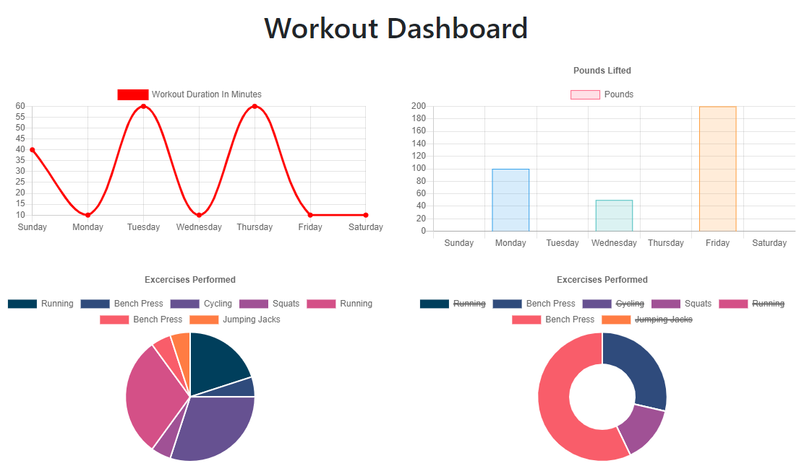

# Workout-Tracker

  ## Description
  This is a fitness tracker application allows the user to view, create, and track daily workouts. It uses a Mongo database with a Mongoose schema and handles routes with Express.

  Link to deployed application:
  https://murmuring-scrubland-28081.herokuapp.com/

  

  ## Table of Contents
  * [Instructions](#instructions)
  * [Usage](#usage)
  * [License](#license)
  * [Contributing](#contributing)
  * [Tests](#tests)
  * [Questions](#questions) 

  ## Instructions
  When the user loads the page, they are be given the option to create a new workout, or continue with their last workout.

    The user can then:

     * Add exercises to a previous workout plan.

     * Add new exercises to a new workout plan.

     * View multiple the combined weight of multiple exercises on the `stats` page.

  ## Usage
  As a user, I want to be able to view create and track daily workouts. I want to be able to log multiple exercises in a workout on a given day. I should also be able to track the name, type, weight, sets, reps, and duration of exercise. If the exercise is a cardio exercise, I should be able to track my distance traveled.

  ## License
  © 2020 Kate Meersman brand. All Rights Reserved.

  

  ## Contributing
  Kate Meersman

  ## Tests

  

  

  ## Questions

  Send email to: katie4682@yahoo.com